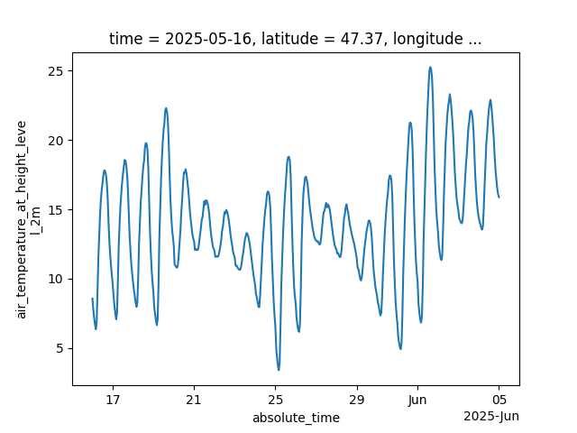
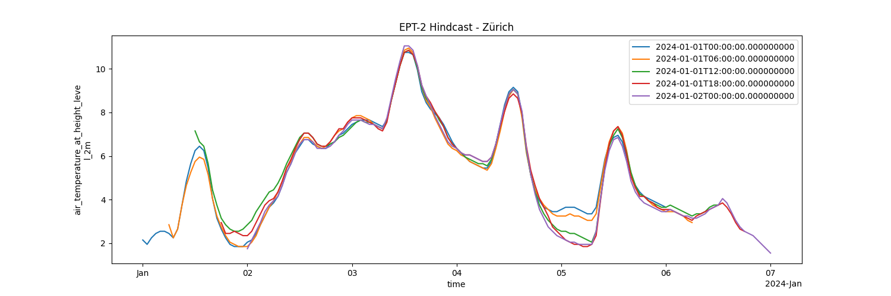

# Jua Python SDK

**Access industry-leading weather forecasts with ease**

The Jua Python SDK provides a simple and powerful interface to Jua's state-of-the-art weather forecasting capabilities. Easily integrate accurate weather data into your applications, research, or analysis workflows.

## Getting Started 🚀

### Prerequisites

- Python 3.11 or higher
- Internet connection for API access

### Installation

Install `jua` with pip:

```
pip install jua
```

Alternatively, checkout [uv](https://docs.astral.sh/uv/) for managing dependencies and Python versions:

```bash
uv init && uv add jua
```

### Authentication

Simply run `jua auth` to authenticate via your web browser. Make sure you are already logged in the [Jua platform](https://platform.jua.ai).
Alternatively, generate an API key from the [Jua platform](https://platform.jua.ai/api-keys) and save it to `~/.jua/default/api-key.json`.

### Datetime resolution

Forecast datetime values are normalized to millisecond resolution.
Applications requiring another resolution must explicitly convert datetime
values before further processing or persistence. Timestamp instants and
timezone semantics remain unchanged.

## Examples

### Obtaining the metadata for a model

```python
from jua import JuaClient
from jua.weather import Models

client = JuaClient()
model = client.weather.get_model(Models.EPT1_5)
metadata = model.get_metadata()

# Print the metadata
print(metadata)
```

### Getting the forecast runs available for a model

```python
from jua import JuaClient
from jua.weather import Models

client = JuaClient()

# Getting metadata the latest forecast run
latest = model.get_latest_init_time()
print(latest)

# Fetching model runs
available_forecasts = model.get_available_forecasts()

# Fetching all model runs for January 2025
#   Results are paginated so we might need to iterate through
result = model.get_available_forecasts(
    since=datetime(2025, 1, 1),
    before=datetime(2025, 1, 31, 23, 59),
    limit=100,
)
all_forecasts = list(result.forecasts)
while result.has_more:
    print("Fetching next page")
    result = result.next()
    all_forecasts.extend(result.forecasts)
```

### Access the latest 20-day forecast for a point location

Retrieve temperature forecasts for Zurich and visualize the data:

```python
import matplotlib.pyplot as plt
from jua import JuaClient
from jua.types.geo import LatLon
from jua.weather import Models, Variables

client = JuaClient()
model = client.weather.get_model(Models.EPT1_5)
zurich = LatLon(lat=47.3769, lon=8.5417)

# Check if 10-day forecast is ready for the latest available init_time
is_ten_day_ready = model.is_ready(forecasted_hours=240)

# Get latest forecast
if is_ten_day_ready:
    forecast = model.get_forecasts(points=[zurich], max_lead_time=240)
    temp_data = forecast[Variables.AIR_TEMPERATURE_AT_HEIGHT_LEVEL_2M]
    temp_data.to_celcius().to_absolute_time().plot()
    plt.show()
```

<details>
<summary>Show output</summary>



</details>

### Access historical weather data

Historical data can be accessed in the same way. In this case, we get all EPT2 forecasts from January 2024, and plot the first 5 together.

```python
from datetime import datetime

import matplotlib.pyplot as plt
from jua import JuaClient
from jua.weather import Models, Variables

client = JuaClient()
zurich = LatLon(lat=47.3769, lon=8.5417)
model = client.weather.get_model(Models.EPT2)
hindcast = model.get_forecasts(
    init_time=slice(
        datetime(2024, 1, 1, 0),
        datetime(2024, 1, 31, 0),
    ),
    points=[zurich],
    min_lead_time=0,
    max_lead_time=(5 * 24),
    variables=[Variables.AIR_TEMPERATURE_AT_HEIGHT_LEVEL_2M],
    method="nearest",
)
data = hindcast[Variables.AIR_TEMPERATURE_AT_HEIGHT_LEVEL_2M]

# Compare the first 5 runs of January
fig, ax = plt.subplots(figsize=(15, 8))
for i in range(5):
    forecast_data = data.isel(init_time=i, points=0).to_celcius().to_absolute_time()
    forecast_data.plot(ax=ax, label=forecast_data.init_time.values)
plt.legend()
plt.show()
```

<details>
<summary>Show output</summary>



### Accessing ERA5 reanalysis

ERA5 is a reconstruction of past weather rather than a forecast, so it has a single `time` dimension: there is no `init_time` or `prediction_timedelta`. Use it for historical analysis, for training and validating models, and for scoring forecasts against what actually happened.

```python
from datetime import datetime

from jua import JuaClient
from jua.types.geo import LatLon
from jua.weather import Variables

client = JuaClient()

# A hourly time series for two cities
zurich = LatLon(lat=47.3769, lon=8.5417)
london = LatLon(lat=51.5074, lon=-0.1278)
data = client.reanalysis.get_data(
    time=slice(datetime(2024, 1, 1), datetime(2024, 2, 1)),
    variables=[Variables.AIR_TEMPERATURE_AT_HEIGHT_LEVEL_2M],
    points=[zurich, london],
)

# Dimensions are (points, time); both the requested and the actual grid
# coordinates are kept as coordinates.
ds = data.to_xarray()
data[Variables.AIR_TEMPERATURE_AT_HEIGHT_LEVEL_2M].isel(points=0).to_celcius().plot()
```

To download a region rather than points, pass `latitude` / `longitude` slices. The result has dimensions `(time, latitude, longitude)` and can be written straight to Zarr:

```python
germany = client.reanalysis.get_data(
    time=slice(datetime(2024, 6, 1), datetime(2024, 7, 1)),
    variables=[
        Variables.AIR_TEMPERATURE_AT_HEIGHT_LEVEL_2M,
        Variables.WIND_SPEED_AT_HEIGHT_LEVEL_100M,
    ],
    latitude=slice(55, 47),
    longitude=slice(5, 15),
)
germany.save()  # ~/.jua/datasets/arco_era5/<name>.zarr
```

Discover what is available:

```python
client.reanalysis.get_variables()   # the 21 variables ERA5 serves
client.reanalysis.get_metadata()    # grid resolution, temporal resolution, units
```

Two things to know:

- **ERA5 is published with a lag of roughly five days**, so recent timestamps do not exist yet. `time` is required and there is no `"latest"` selector.
- **A single request is capped at 5 million rows** (rows = points x hourly timesteps). That is about five months of hourly data over a Germany-sized box, or under five hours of the full global grid. Oversized requests raise a `ValueError` with the estimate before any request is sent, so split long ranges into chunks.

### Accessing Market Aggregates

The `AggregateVariables` enum provides the following variables:

- `WIND_SPEED_AT_HEIGHT_LEVEL_10M` - Wind speed at 10m height (`Weighting.WIND_CAPACITY`)
- `WIND_SPEED_AT_HEIGHT_LEVEL_100M` - Wind speed at 100m height (`Weighting.WIND_CAPACITY`)
- `SURFACE_DOWNWELLING_SHORTWAVE_FLUX_SUM_1H` - Surface downwelling shortwave flux (`Weighting.SOLAR_CAPACITY`)
- `AIR_TEMPERATURE_AT_HEIGHT_LEVEL_2M` - Air temperature at 2m height (`Weighting.POPULATION`)


Comparing the latest EPT2 and ECMWF IFS run for the Ireland and Northern Ireland market zones:

```python
from jua import JuaClient
from jua.market_aggregates import AggregateVariables, ModelRuns
from jua.types import Countries, MarketZones
from jua.weather import Models, Variables

client = JuaClient()

# Create energy market using MarketZones enum
ir_nir = client.market_aggregates.get_market([MarketZones.IE, MarketZones.GB_NIR])

# Get the market aggregates for the latest EPT2 and ECMWF IFS runs
model_runs = [ModelRuns(Models.EPT2, 0), ModelRuns(Models.ECMWF_IFS_SINGLE, 0)]
ds = ir_nir.compare_runs(
    agg_variable=AggregateVariables.WIND_SPEED_AT_HEIGHT_LEVEL_10M,
    model_runs=model_runs,
    max_lead_time=24,
)

print("Retrieved dataset:")
print(ds)
print()
```

Obtaining all market zones for a country:

```python
from jua.types import Countries, MarketZones

norway_zones = MarketZones.filter_by_country(Countries.NORWAY)
print(f"Norwegian zones: {[z.zone_name for z in norway_zones]}")
```

</details>

## Documentation

For comprehensive documentation, visit [docs.jua.ai](https://docs.jua.ai).

## Contributing

See the [contribution guide](./CONTRIBUTING.md) to get started.

## Changes

See the [changelog](./CHANGELOG.md) for the latest changes.

## Support

If you encounter any issues or have questions, please:

- Check the [documentation](https://docs.jua.ai)
- Open an issue on GitHub
- Contact support@jua.ai

## License

This project is licensed under the MIT License - see the LICENSE file for details.
